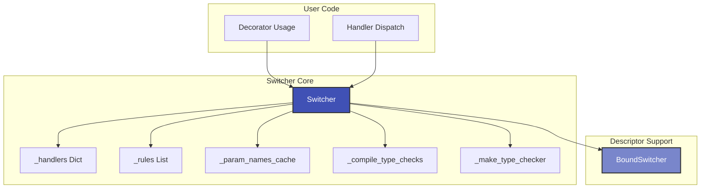
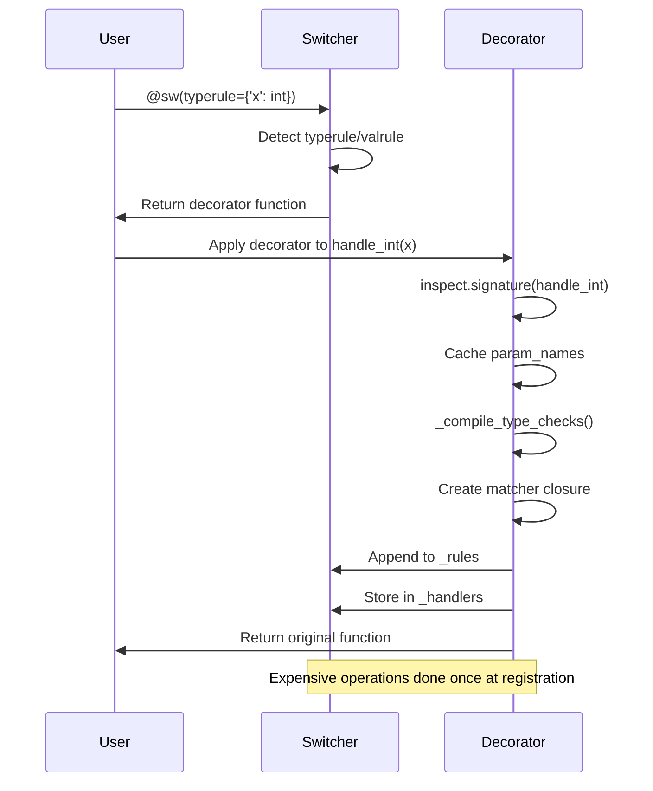
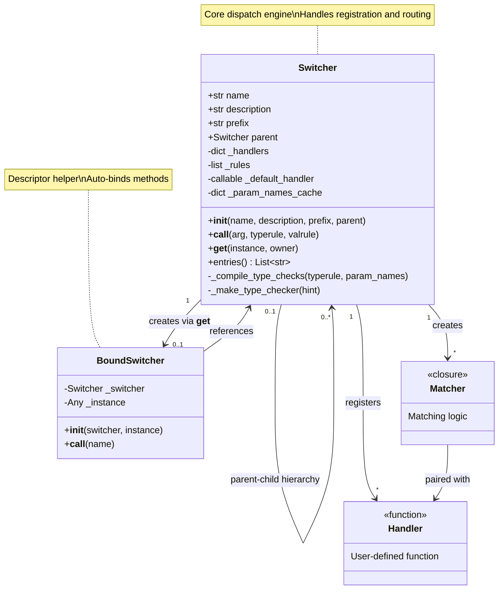

# Architecture Deep Dive

This document provides a detailed look at SmartSwitch's internal architecture, design decisions, and component interactions.

---

## Architecture Overview



SmartSwitch consists of two main classes:

- **Switcher**: The core engine handling registration and dispatch
- **BoundSwitcher**: Descriptor helper for automatic method binding in classes

---

## Registration Flow



**Key Points**:

1. **Signature Inspection**: Done once and cached - no repeated introspection
2. **Type Checker Compilation**: Type checks pre-compiled into fast lambda functions
3. **Matcher Closure**: Captures all context needed for dispatch
4. **Registry Storage**: Handlers stored by name for direct lookup

---

## Dispatch Flow

```mermaid
sequenceDiagram
    participant User
    participant Switcher
    participant Matcher
    participant Handler

    User->>Switcher: sw()(x=42)
    Note over Switcher: arg is None → dispatcher mode
    Switcher->>User: Return invoker closure

    User->>Switcher: invoker(x=42)

    Note over Switcher: Iterate through _rules
    Switcher->>Matcher: Check rule 1
    Matcher->>Matcher: Build args_dict
    Matcher->>Matcher: Run type check
    Matcher->>Matcher: Run value rule
    Matcher-->>Switcher: No match, try next

    Switcher->>Matcher: Check rule 2
    Matcher->>Matcher: Build args_dict
    Matcher->>Matcher: Run type check
    Matcher-->>Switcher: Match found!

    Switcher->>Handler: Call handler(x=42)
    Handler-->>User: Return result

    Note over Switcher,Handler: Early exit on first match<br/>No dynamic introspection
```



**Performance Optimizations**:

1. **Manual Args Dict Building**: Avoids expensive `bind_partial()` - 60% faster
2. **Pre-Compiled Checkers**: No runtime type introspection - 3x faster
3. **Early Exit**: Returns immediately on first match
4. **No Dynamic Calls**: All function references captured at registration

---

## Class Relationships



---

## Module Structure

```
src/smartswitch/
├── __init__.py          # Public API exports (4 lines)
└── core.py              # Core implementation (328 lines)
    ├── BoundSwitcher    # Lines 12-36 (23 lines)
    └── Switcher         # Lines 38-328 (305 lines)
```

**Design**: Intentionally minimal - single file core with zero external dependencies.

---

## Component Responsibilities

### **Switcher** (Main Engine)

**File**: `src/smartswitch/core.py:38-328`

**Core Responsibility**: Complete handler lifecycle - registration, matching, dispatch.

**Public API**:

- `__init__(name, description, prefix)` - Configure switcher instance
- `__call__(...)` - Multi-purpose: decorator, lookup, dispatcher (5 modes)
- `__get__(...)` - Descriptor protocol for automatic method binding

**Internal State**:

- `_handlers: Dict[str, Callable]` - Name-to-function registry
- `_rules: List[Tuple[Callable, Callable]]` - Ordered (matcher, handler) pairs
- `_param_names_cache: Dict` - Cached signature inspection results

**Helper Methods**:

- `_compile_type_checks()` - Pre-compiles type checkers for fast dispatch
- `_make_type_checker()` - Recursive factory for type checking functions

---

### **BoundSwitcher** (Descriptor Helper)

**File**: `src/smartswitch/core.py:12-36`

**Core Responsibility**: Automatic handler binding for class-based usage.

**Usage Pattern**:

```python
class MyClass:
    switch = Switcher()  # Class attribute

    @switch
    def method(self, x):
        return x * 2

obj = MyClass()
obj.switch("method")  # Returns bound method automatically!
```

**How It Works**:

1. `Switcher.__get__(obj, MyClass)` called by Python descriptor protocol
2. Returns `BoundSwitcher(switcher, obj)`
3. `BoundSwitcher("method")` retrieves handler and binds with `partial(handler, obj)`
4. User gets ready-to-call bound method - zero boilerplate!

---

## Key Design Decisions

### **1. Multi-Mode `__call__`**

**Rationale**: Single entry point for all operations → cleaner, more discoverable API

**Trade-off**: High internal complexity (175 lines, 5 distinct modes) vs simple user experience

**Five Modes**:

1. `@sw` - Register as default handler
2. `@sw('alias')` - Register with custom name
3. `@sw(typerule=..., valrule=...)` - Register with matching rules
4. `sw("name")` - Lookup handler by name
5. `sw()` - Get dispatcher function

---

### **2. Pre-Compiled Type Checkers**

**Problem**: `isinstance()` checks on every dispatch call → expensive

**Solution**: Compile type checking logic once at registration time

**Implementation**:

```python
# Registration time (once):
checker = lambda val: isinstance(val, int)

# Dispatch time (many times):
if not checker(value):  # Fast function call
    return False
```

**Performance Gain**: 3x faster dispatch compared to runtime introspection

---

### **3. Manual Kwargs Building**

**Problem**: `inspect.Signature.bind_partial()` is slow (calls inspect internally)

**Solution**: Build args dict manually with simple loop

**Implementation**:

```python
# Fast manual build:
args_dict = {}
for i, name in enumerate(param_names):  # Cached!
    if i < len(a):
        args_dict[name] = a[i]
    elif name in kw:
        args_dict[name] = kw[name]
```

**Performance Gain**: 60% reduction in dispatch overhead

---

### **4. Descriptor Protocol**

**Problem**: Class-based handlers need `self` binding

**Naive Approach**: Users must manually `partial(handler, self)` - error-prone

**Solution**: Implement `__get__` to return `BoundSwitcher` automatically

**Benefit**: Pythonic magic - users get bound methods for free

---

### **5. Immutable Slots**

**Rationale**: Prevent accidental attribute creation + reduce memory footprint

**Implementation**: Both classes use `__slots__` to declare fixed attributes

**Benefits**:

- Memory: ~40% reduction per instance
- Safety: Typos raise `AttributeError` instead of silently creating new attributes

---

## Component Interaction Summary

| Component | Calls | Called By | Data Shared |
|-----------|-------|-----------|-------------|
| `Switcher.__call__` | `_compile_type_checks`, `_make_type_checker`, `inspect.signature` | User code (decorator/dispatch) | `_rules`, `_handlers`, `_param_names_cache` |
| `_compile_type_checks` | `_make_type_checker` | `Switcher.__call__` | typerule dict, param_names |
| `_make_type_checker` | `get_origin`, `get_args`, recursive self | `_compile_type_checks` | Type hints |
| `BoundSwitcher.__call__` | `partial` | User code (via descriptor) | `_switcher._handlers`, `_instance` |
| `Switcher.__get__` | `BoundSwitcher()` | Python descriptor protocol | self, instance |

---

## Performance Characteristics

**Dispatch Overhead**: ~1-2 microseconds per call

**Ideal Use Cases**:

- Functions doing real work (>1ms)
- I/O operations (API calls, database queries)
- Business logic with complex routing needs

**Not Ideal For**:

- Ultra-fast functions (<10μs) called millions of times
- Performance-critical tight loops

**Optimizations Applied**:

1. **Signature Caching**: `inspect.signature()` called once per function
2. **Pre-Compiled Type Checks**: Type checkers compiled at registration
3. **Manual Kwargs Building**: Avoids expensive `bind_partial()` overhead
4. **`__slots__`**: Reduced memory footprint per instance

---

## Thread Safety Considerations

**Dispatch Operations**: ✅ **Thread-safe** (read-only, no mutations)

**Registration Operations**: ⚠️ **Not thread-safe**

- Decorator application mutates `_handlers` and `_rules`
- **Recommended Usage**: Apply decorators at module import time (single-threaded)
- **Multi-threaded Apps**: If runtime registration needed, use external locking

---

## Extension Points

SmartSwitch's architecture supports future enhancements:

**1. Async Support**

```python
# Detect async handlers
if inspect.iscoroutinefunction(func):
    return func(*args, **kwargs)  # Return coroutine
```

**2. Custom Matchers**

Extend beyond `typerule`/`valrule` with custom matching logic:

```python
@sw(custom_matcher=lambda args: args['priority'] == 'high')
def urgent_handler(priority, task):
    ...
```

**3. Logging/Observability**

Hook into registration and dispatch for monitoring:

```python
sw.add_logger('read', 'write', time=True, before=True, after=True)
```

**4. Result Caching**

Cache dispatch results for pure functions:

```python
@sw(typerule={'x': int}, cache=True)
def expensive_calc(x):
    ...
```

---

## Design Principles Applied

- ✅ **Single Responsibility**: Each class has one clear purpose
- ✅ **Open/Closed**: Open for extension (custom matchers), closed for modification
- ✅ **Performance First**: Optimizations based on profiling, not premature optimization
- ✅ **Zero Dependencies**: Core uses only Python stdlib
- ✅ **Type Safety**: Full type hints for modern Python (3.10+)
- ✅ **Immutability**: `__slots__` prevents accidental state mutation

---

**For implementation details**, see the [source code](https://github.com/genropy/smartswitch/blob/main/src/smartswitch/core.py).
