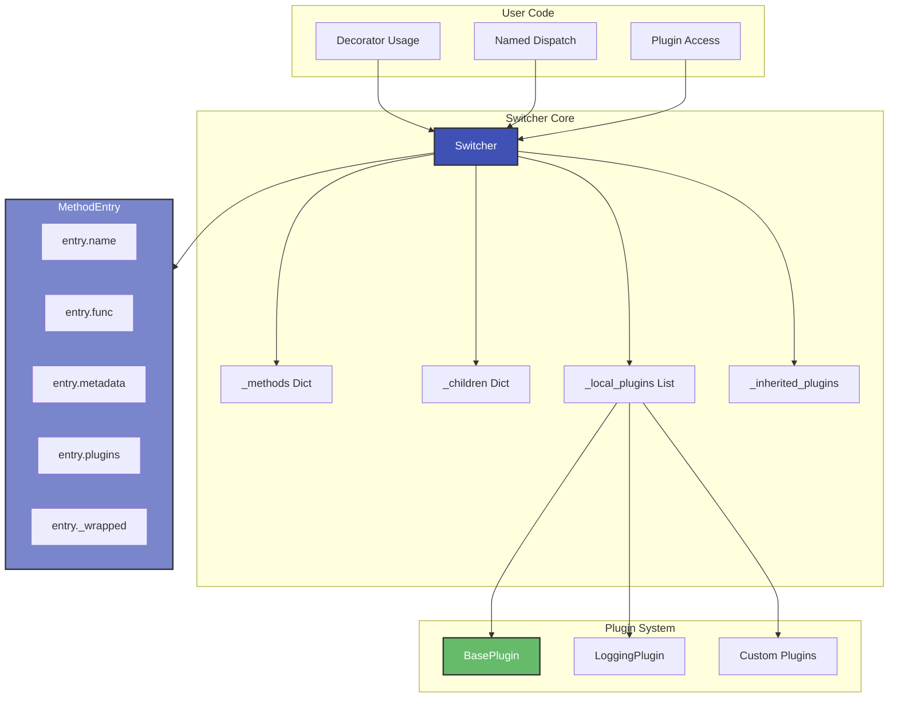
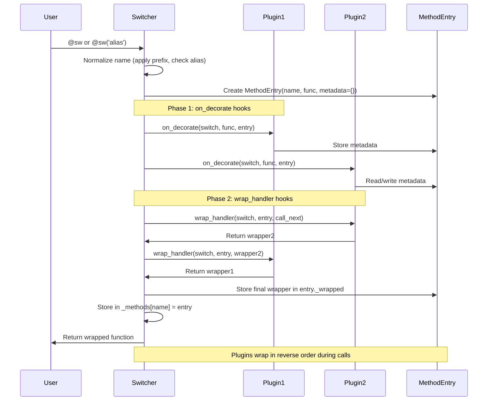
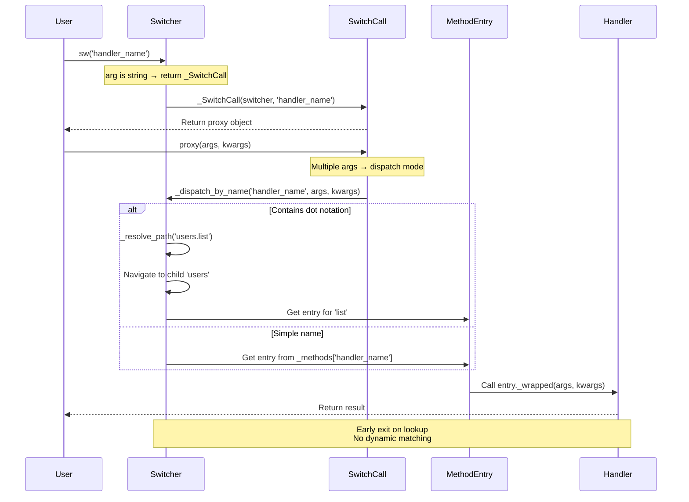
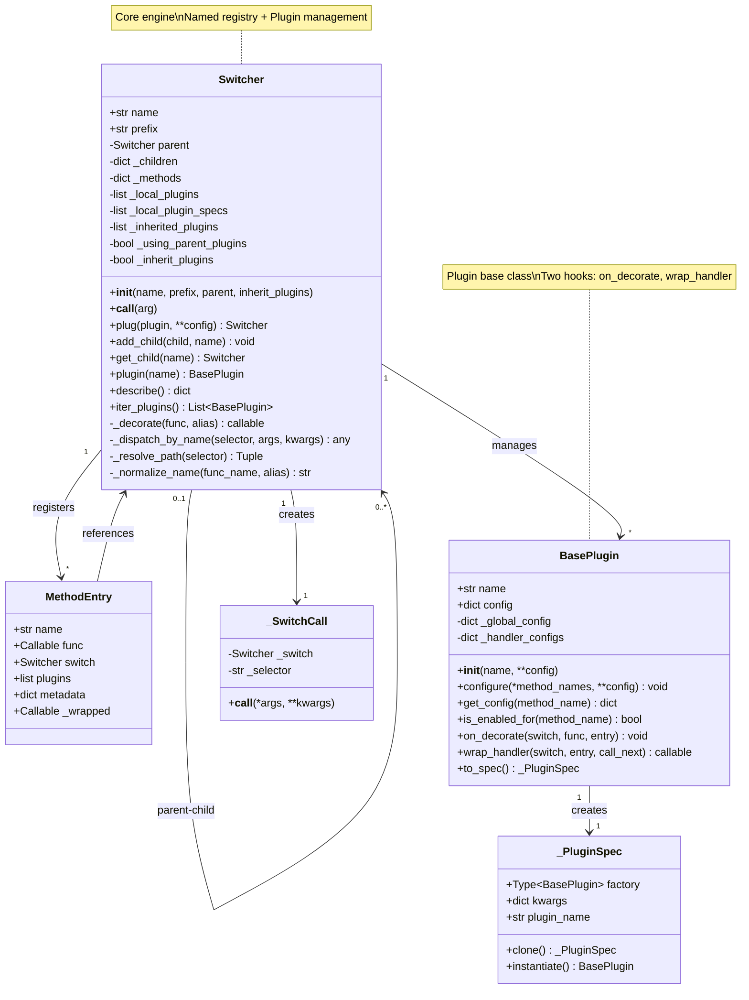

# Architecture Deep Dive

This document provides a detailed look at SmartSwitch's internal architecture, design decisions, and component interactions.

---

## Architecture Overview



SmartSwitch consists of core components and plugin system:

- **Switcher**: Core engine handling registration, named dispatch, and plugin management
- **MethodEntry**: Dataclass containing method metadata and plugin information
- **Plugin System**: Extensible middleware architecture with `on_decorate` and `wrap_handler` hooks
- **Hierarchical Structure**: Parent-child Switcher relationships with dotted-path access

---

## Registration Flow



**Key Points**:

1. **Name Normalization**: Prefix stripping and alias handling happen first
2. **MethodEntry Creation**: Each handler gets a MethodEntry with name, func, metadata
3. **Plugin Hooks**: Two-phase system - on_decorate for setup, wrap_handler for wrapping
4. **Metadata Sharing**: Plugins store/read data in entry.metadata by namespace
5. **Middleware Chain**: Plugins wrap handlers in order, execute in reverse during calls

---

## Named Dispatch Flow



**Performance Characteristics**:

1. **Direct Lookup**: O(1) dictionary access by name
2. **No Matching Logic**: No type/value checking - just registry lookup
3. **Dotted Path**: O(k) where k = number of dots (parent navigation)
4. **Cached Wrappers**: Plugin chain built once at registration time

---

## Class Relationships



---

## Module Structure

```
src/smartswitch/
├── __init__.py          # Public API exports
└── core.py              # Core implementation (~706 lines)
    ├── _activation_ctx        # Lines 31-54 (Thread-local context)
    ├── _runtime_ctx           # Lines 31-54 (Thread-local context)
    ├── MethodEntry            # Lines 62-71 (Dataclass)
    ├── _PluginSpec            # Lines 74-89 (Plugin factory)
    ├── BasePlugin             # Lines 96-170 (Plugin base)
    ├── _SwitchCall            # Lines 177-197 (Dispatch proxy)
    └── Switcher               # Lines 204-706 (Main engine)
        ├── Plugin Registry    # Lines 230-242
        ├── Initialization     # Lines 244-271
        ├── Children           # Lines 273-348
        ├── Plugin Management  # Lines 352-467
        ├── Decoration         # Lines 500-552
        ├── Dispatch           # Lines 556-686
        └── Introspection      # Lines 690-706
```

**Design**: Intentionally minimal - single file core with zero external dependencies (stdlib only).

---

## Component Responsibilities

### **Switcher** (Main Engine)

**File**: `src/smartswitch/core.py:204-706`

**Core Responsibility**: Complete handler lifecycle - registration, named dispatch, plugin management, hierarchical organization.

**Public API**:

- `__init__(name, prefix, parent, inherit_plugins)` - Configure switcher instance
- `__call__(arg)` - Multi-purpose: decorator or named dispatch
- `plug(plugin, **config)` - Attach plugins with configuration
- `add_child(child, name)` - Build hierarchical structures
- `plugin(name)` - Retrieve plugin by name
- `describe()` - Introspection API

**Internal State**:

- `_methods: Dict[str, MethodEntry]` - Name-to-MethodEntry registry
- `_children: Dict[str, Switcher]` - Child switchers for hierarchy
- `_local_plugins: List[BasePlugin]` - Active plugins for this switcher
- `_inherited_plugins: List[BasePlugin]` - Copied from parent (if inheriting)

**Helper Methods**:

- `_normalize_name(func_name, alias)` - Apply prefix, handle alias, check collisions
- `_resolve_path(selector)` - Navigate dotted paths like 'users.list'
- `_dispatch_by_name(selector, *args, **kwargs)` - Named handler invocation
- `_decorate(func, alias)` - Core decoration logic with plugin hooks

---

### **BasePlugin** (Plugin Base Class)

**File**: `src/smartswitch/core.py:96-170`

**Core Responsibility**: Provide extension points for custom functionality.

**Two Main Hooks**:

1. **`on_decorate(switch, func, entry)`**: Called once at decoration time
   - Can mutate `entry.metadata`
   - Can replace `entry.func` (rare, advanced use)
   - Used for: metadata collection, validation setup

2. **`wrap_handler(switch, entry, call_next)`**: Called during wrapper chain construction
   - Returns a wrapper callable that must call `call_next`
   - Used for: logging, caching, validation, timing, error handling

**Configuration System**:

- Global config: `plugin.configure(**config)` - applies to all handlers
- Per-handler config: `plugin.configure('handler1', 'handler2', enabled=False)`
- Merged at access: `plugin.get_config(handler_name)`

---

### **_SwitchCall** (Dispatch Proxy)

**File**: `src/smartswitch/core.py:177-197`

**Core Responsibility**: Bridge between `sw('name')` and actual dispatch.

**Usage Pattern**:

```python
# User calls this:
sw('save_data')("file.txt")

# Internally:
proxy = _SwitchCall(sw, 'save_data')  # sw('save_data') returns this
proxy("file.txt")                      # proxy.__call__ triggers dispatch
```

**Dual Purpose**:

1. **Decorator Alias**: `@sw('alias')` - single callable arg → decorator mode
2. **Named Dispatch**: `sw('name')(args)` - multiple args → dispatch mode

---

### **MethodEntry** (Method Metadata)

**File**: `src/smartswitch/core.py:62-71`

**Core Responsibility**: Store metadata for registered handlers.

**Fields**:

- `name: str` - Registered name (after prefix stripping/aliasing)
- `func: Callable` - Original function (unwrapped)
- `switch: Switcher` - Owning switcher instance
- `plugins: List[str]` - Ordered list of plugin names active at decoration
- `metadata: Dict[str, Any]` - Shared metadata dict (plugins namespace it)
- `_wrapped: Callable` - Final wrapped function (after all plugins)

---

## Key Design Decisions

### **1. Named Registry (Not Rule-Based)**

**Rationale**: Simplicity and predictability - users explicitly name handlers, no magic matching.

**Benefits**:
- O(1) lookup by name
- No ambiguous matches
- Clear call semantics
- Easy debugging

**Trade-off**: Users must know handler names (vs automatic type/value dispatch)

---

### **2. Plugin System with Two Hooks**

**Rationale**: Separation of concerns - decoration-time setup vs runtime wrapping.

**`on_decorate` Hook**:
- Runs once at decoration time
- Can inspect function signature
- Can store metadata for later use
- Cannot wrap (happens before wrapping phase)

**`wrap_handler` Hook**:
- Runs during wrapper chain construction
- Returns wrapper function
- Can access metadata from `on_decorate`
- Executes on every handler call

**Example Flow**:
```python
# Plugin A
def on_decorate(switch, func, entry):
    entry.metadata['needs_auth'] = True

def wrap_handler(switch, entry, call_next):
    def wrapper(*args, **kwargs):
        if entry.metadata.get('needs_auth'):
            check_auth()  # Use metadata set earlier
        return call_next(*args, **kwargs)
    return wrapper
```

---

### **3. Prefix-Based Auto-Naming**

**Problem**: Python methods often follow naming conventions (e.g., `do_save`, `do_load`)

**Solution**: Strip common prefix automatically

**Implementation**:
```python
sw = Switcher(prefix='do_')

@sw
def do_save(data):  # Registered as 'save'
    ...

sw('save')(data)  # Call by short name
```

**Benefits**:
- Keep IDE-friendly function names
- Get clean registry names
- Convention over configuration

---

### **4. Hierarchical Organization**

**Problem**: Complex systems need namespace organization

**Solution**: Parent-child Switcher relationships with dotted-path access

**Implementation**:
```python
main = Switcher(name="main")
users = Switcher(name="users", parent=main)

@users
def list_users(): ...

# Two ways to call:
users('list_users')()          # Direct
main('users.list_users')()     # Hierarchical
```

**Benefits**:
- Clear namespace boundaries
- Both direct and hierarchical access
- Easy discovery via `describe()`

---

### **5. Plugin Inheritance**

**Problem**: Child switchers often need same plugins as parent

**Solution**: Two inheritance modes

**Use Parent Plugins** (default with `inherit_plugins=True`):
```python
main.plug(LoggingPlugin())
child = Switcher(parent=main, inherit_plugins=True)
# child automatically uses LoggingPlugin
```

**Copy Then Extend**:
```python
child = Switcher(parent=main, inherit_plugins=False)
child.copy_plugins_from_parent()
child.plug(CachePlugin())  # Add extra plugin
```

**Benefits**:
- DRY - configure plugins once
- Flexibility - children can customize
- Clear semantics - explicit modes

---

### **6. Thread-Local Runtime Data**

**Problem**: Per-instance, per-method, per-plugin state needs thread safety

**Solution**: `contextvars` for thread-local storage

**Implementation**:
```python
_activation_ctx: ContextVar[Dict] = ContextVar('smartswitch_activation')
_runtime_ctx: ContextVar[Dict] = ContextVar('smartswitch_runtime')
```

**Benefits**:
- Thread-safe without locks
- Async-compatible (contextvars work with asyncio)
- No global state pollution

**Usage**:
```python
# Enable/disable plugin for specific instance + handler
sw.set_plugin_enabled(instance, 'handler', 'PluginName', False)

# Store plugin-specific data
sw.set_runtime_data(instance, 'handler', 'PluginName', 'key', value)
```

---

## Component Interaction Summary

| Component | Calls | Called By | Data Shared |
|-----------|-------|-----------|-------------|
| `Switcher.__call__` | `_decorate`, `_dispatch_by_name`, `_SwitchCall()` | User code | `_methods`, `_children` |
| `_decorate` | `_normalize_name`, plugin hooks | `Switcher.__call__` | MethodEntry |
| `_dispatch_by_name` | `_resolve_path`, `entry._wrapped` | `_SwitchCall.__call__` | `_methods` |
| `_resolve_path` | `get_child` | `_dispatch_by_name` | `_children` |
| `BasePlugin.wrap_handler` | `call_next` | `Switcher._decorate` | entry.metadata |
| `_SwitchCall.__call__` | `_dispatch_by_name`, `_decorate` | User code | selector string |

---

## Performance Characteristics

**Named Dispatch Overhead**: ~1-2 microseconds per call

**Breakdown**:
- Dictionary lookup: ~0.1μs
- Plugin wrapper calls: ~0.5-1.5μs (depends on plugin count)
- Function call overhead: ~0.1μs

**Ideal Use Cases**:

- Functions doing real work (>1ms)
- I/O operations (API calls, database queries)
- Business logic with naming/routing needs

**Not Ideal For**:

- Ultra-fast functions (<10μs) called millions of times
- Performance-critical tight loops

**Optimizations Applied**:

1. **Direct Lookup**: O(1) dictionary access, no iteration
2. **Cached Wrappers**: Plugin chain built once at registration
3. **No Dynamic Introspection**: All function refs captured at registration
4. **`__slots__`**: Reduced memory footprint per instance

---

## Thread Safety Considerations

**Named Dispatch**: ✅ **Thread-safe** (read-only dictionary access)

**Registration**: ⚠️ **Not thread-safe**

- Decorator application mutates `_methods` and `_children`
- **Recommended Usage**: Apply decorators at module import time (single-threaded)
- **Multi-threaded Apps**: If runtime registration needed, use external locking

**Plugin Runtime Control**: ✅ **Thread-safe** (uses `contextvars`)

- `set_plugin_enabled()` and `set_runtime_data()` are thread-local
- Each thread/async task has isolated state

---

## Plugin System Details

### Plugin Registration

**Three Ways to Add Plugins**:

```python
# 1. By registered name (must call Switcher.register_plugin first)
Switcher.register_plugin('logging', LoggingPlugin)
sw.plug('logging', mode='silent')

# 2. By class
sw.plug(LoggingPlugin, mode='silent')

# 3. By instance
sw.plug(LoggingPlugin(mode='silent'))
```

### Plugin Naming

**Automatic Naming**:
- From `name` parameter: `LoggingPlugin(name='mylogger')`
- From class name: `LoggingPlugin()` → name is `'LoggingPlugin'`

**Access Patterns**:
```python
sw.plug('logging', mode='silent')

# Access via .plugin() method
sw.plugin('logging').history()

# Access via attribute (uses __getattr__)
sw.logging.history()
```

### Metadata Namespace Convention

Plugins should namespace their metadata to avoid collisions:

```python
class MyPlugin(BasePlugin):
    def on_decorate(self, switch, func, entry):
        entry.metadata[self.name] = {  # Use plugin name as key
            'enabled': True,
            'config': self.config
        }
```

---

## Introspection API

### describe() Method

Returns complete switcher state:

```python
sw.describe()
# {
#   'name': 'main',
#   'prefix': 'do_',
#   'plugins': ['LoggingPlugin', 'CachePlugin'],
#   'methods': {
#     'save': {
#       'plugins': ['LoggingPlugin', 'CachePlugin'],
#       'metadata_keys': ['LoggingPlugin', 'CachePlugin']
#     }
#   },
#   'children': {
#     'users': { ... }
#   }
# }
```

### Direct Access

For power users:

```python
sw._methods         # Dict[str, MethodEntry]
sw._children        # Dict[str, Switcher]
sw.iter_plugins()   # List[BasePlugin]
```

---

## Future Extension Points

SmartSwitch's architecture supports potential enhancements:

**1. Async Support**

Detect and handle async handlers:

```python
@sw
async def fetch_data(url):
    return await http.get(url)

# Await automatically
result = await sw('fetch_data')('https://...')
```

**2. Remote Handlers**

Dispatch over network:

```python
@sw.remote('http://api.example.com')
def remote_calculation(x, y):
    pass  # Executed remotely
```

**3. Result Caching Plugin**

Cache based on arguments:

```python
sw.plug(CachePlugin(ttl=300, key=lambda args, kwargs: hash(args)))
```

---

## Design Principles Applied

- ✅ **Single Responsibility**: Each class has one clear purpose
- ✅ **Open/Closed**: Open for extension (plugins), closed for modification
- ✅ **Simplicity First**: Named registry over complex matching logic
- ✅ **Zero Dependencies**: Core uses only Python stdlib
- ✅ **Type Safety**: Full type hints for modern Python (3.10+)
- ✅ **Explicit Over Implicit**: Named dispatch, no magic matching
- ✅ **Composability**: Plugins chain cleanly, parent-child hierarchy

---

**For implementation details**, see the [source code](https://github.com/genropy/smartswitch/blob/main/src/smartswitch/core.py).
